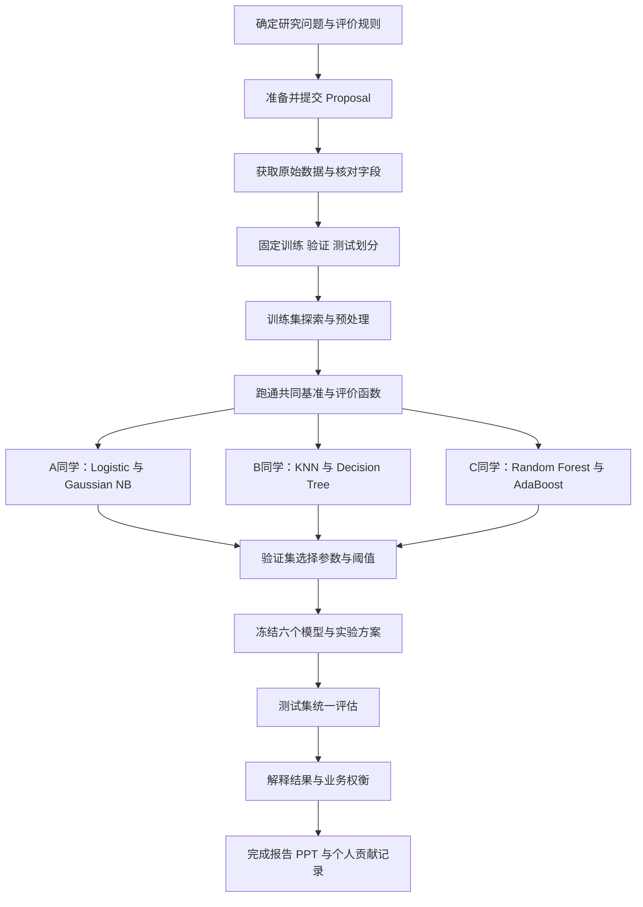

# 信用卡违约项目总体工作流程

[**返回导航**](00_选题筛选与使用说明.md) · [**上一章**](02_Credit_Default_Proposal_Example.md) · [**下一章**](00_选题筛选与使用说明.md)

**项目已确定：信用卡违约预测。** 本文是建议执行方案，衔接现有英文 proposal；阶段产出尚待你们实际完成，不代表已经下载数据、训练模型或获得结果。

**建议题目：Credit Card Default Prediction: Comparing Simple Models and Decision Thresholds**

**核心问题：不同模型与分类阈值，如何影响“识别违约客户”和“误报正常客户”之间的权衡？**

保持一个数据集、六个传统分类模型、一个阈值分析扩展。先做好可复现的比较，额外方法按需要再讨论。

## 1. 一张图看完整项目



这张图里的 Proposal 是研究计划。按你们目前的 9 月 18 日安排，提交前优先完成第 0 阶段，以及数据可获得性和字段的初步确认；不需要把后续模型实验全部提前做完。具体提交要求以老师最新通知为准。

## 2. 全组先统一的八项约定

| 项目 | 本方案约定 |
|---|---|
| 数据 | UCI Default of Credit Card Clients，一个固定下载版本 |
| 观察单位 | 一条客户记录；特征是历史信息，目标是下一月是否违约 |
| 标签 | $y=1$ 表示违约，$y=0$ 表示未违约；指标都以 1 为正类 |
| 模型 | Logistic Regression、Gaussian Naive Bayes、KNN、Decision Tree、Random Forest、AdaBoost |
| 划分 | 训练 60%、验证 20%、测试 20%；固定种子，例如 42，并保存行索引 |
| 参数选择 | 各模型用验证集 AP 选择少量候选中的一套参数 |
| 决策分析 | 每个模型比较阈值 0.5 与验证集选择的成本最小阈值 |
| 主指标 | AP；辅助看 ROC-AUC、precision、recall、混淆矩阵及假设成本 |

这些是团队的实验约定，不是新增的教师硬性要求。六个模型安排对应此前课件手写批注“每人 2–3 个模型”，每人两个即可。

**AP（average precision）**汇总 precision–recall 曲线上的表现，适合观察违约这一正类的识别质量；它不等同于 accuracy，也不要把它与梯形积分得到的 PR-AUC 不加区分地混写。报告中明确使用 `average_precision_score` 的定义。[AP 官方说明](https://scikit-learn.org/stable/modules/generated/sklearn.metrics.average_precision_score.html)

## 3. 分阶段执行清单

### 阶段 0：写清研究设计，完成 Proposal

**要做的事**

1. 共同确认题目与一句话研究问题。
2. 打开 [UCI 官方数据页](https://archive.ics.uci.edu/dataset/350/default+of+credit+card+clients)，核对下载入口、标签和字段说明。
3. 在 [英文示例](02_Credit_Default_Proposal_Example.md) 中填写姓名、分工和计划日期。
4. 确认主指标、60/20/20 划分、六个模型和成本情景。
5. 把“计划验证的假设”与“已经获得的结果”写清楚。目前不要写某模型将达到多少准确率。

**产出**：一份全组认可的英文 proposal；一页实验约定。

**完成标准**：每个人都能回答“预测谁、预测什么、用什么数据、怎样比较好坏”。

**引用说明：**

Install the ucimlrepo package 

```
pip install ucimlrepo
```

Import the dataset into your code 

```
from ucimlrepo import fetch_ucirepo 
  
# fetch dataset 
default_of_credit_card_clients = fetch_ucirepo(id=350) 
  
# data (as pandas dataframes) 
X = default_of_credit_card_clients.data.features 
y = default_of_credit_card_clients.data.targets 
  
# metadata 
print(default_of_credit_card_clients.metadata) 
  
# variable information 
print(default_of_credit_card_clients.variables) 
```

### 阶段 1：下载数据，建立数据字典

**要做的事**

- 保留原始文件，记录来源、下载日期、版本/文件校验值和引用。
- 核对实际行数、列数、目标列和 ID。官方介绍为 30,000 条记录、23 个预测变量，仍需检查下载文件是否一致。
- 分类整理：额度、还款状态、账单金额、付款金额、人口统计类别等。
- 检查缺失值、异常编码、重复 ID、复制记录与标签值。编码为 0、负数或“unknown”不自动等于错误数据。
- 核实还款状态中的特殊代码含义后再处理，不把所有负值直接删掉。若无法确认，记录为特殊类别及其局限。
- 移除 ID 的预测作用，但保留它用于追踪样本和划分。

仅特征相同的两位客户不一定是重复记录。对确认的复制行或重复业务实体统一去重/分组，记录理由；不要为了让结果更好而任意删样本。

**产出**：原始数据、数据字典、数据检查记录。

**完成标准**：知道每类变量是什么、在预测时是否已知，标签 1/0 没有颠倒。

### 阶段 2：先固定数据划分，再做数据驱动分析

若没有需要整体分组的记录，做固定随机种子的分层划分，使三份数据的违约比例大致接近。若存在确认相关记录，优先保证相关记录不跨集合，并记录比例的偏差。

分层是按照标签保持比例，不是把数据按标签排好后切片。保存每行属于 train、validation 或 test 的结果，全组直接复用。30,000 条数据全部保留时，目标规模约为 18,000 / 6,000 / 6,000；清洗或分组后实际数量可能不同。

- **训练集（training set）**：探索数据、拟合预处理与模型。
- **验证集（validation set）**：有限次数选择参数和阈值。
- **测试集（test set）**：最终评估，先保留不查看实验表现。

初步结构核验与分层需要读取标签；但特征选择、编码中的统计规则、标准化、调参等建模选择不能由测试表现决定。详细特征—标签关系图先只看训练集。

**产出**：划分索引文件、样本量与正类比例表、随机种子记录。

**完成标准**：三份索引无交叉，相关实体处理有说明，三名成员使用完全相同的划分。

### 阶段 3：建立全组共用的预处理与评价流程

先跑通 Majority baseline 和 Logistic Regression，确认“读取 → 预处理 → 拟合 → 输出违约分数 → 评价”能够完整执行，再分头扩展模型。

**预处理原则**

- 类别变量使用一致且记录清楚的编码，例如 one-hot；有顺序的还款状态如何表示，须预先约定。
- 数值标准化对 Logistic Regression 和 KNN 尤其有用；树模型通常无需标准化。
- 若有缺失，填补值从训练集估计；验证、测试只使用已拟合的处理规则。
- 同一特征含义、数据清洗规则和评价口径全组一致。允许为模型使用适合它的预处理，但须记录。
- 建议用 `Pipeline` / `ColumnTransformer` 串联预处理与模型，减少误操作。[预处理与泄漏官方说明](https://scikit-learn.org/stable/common_pitfalls.html)

Gaussian Naive Bayes 是简单比较基准，其高斯和条件独立假设可能与实际数据不符，解释时要承认这一点。

**两个基准输出**

1. 始终预测未违约的多数类决策，帮助说明 accuracy 为什么可能误导。
2. 对所有样本输出同一个训练集违约率，作为常数风险分数基准。若评估集中两类均存在，它的 ROC-AUC 为 0.5，AP 等于该评估集的正类比例。

统一保存正类 $y=1$ 的预测分数，检查模型的类别列顺序。AP 和 ROC-AUC 应使用连续分数，不能把已经阈值化的 0/1 标签当作主要输入。

**产出**：共享预处理、共享评价函数、可运行的 Logistic 基准、基准结果表。

**完成标准**：任何成员都能复现同一份基准结果，且没有在验证/测试数据上拟合预处理。

### 阶段 4：每人两个模型，做小范围比较

| 成员 | 负责模型 | 额外主要职责 |
|---|---|---|
| A（可由你承担） | Logistic Regression、Gaussian Naive Bayes | 金融问题、数据说明与成本假设解释 |
| B | KNN、Decision Tree | 划分检查、参数与实验记录 |
| C | Random Forest、AdaBoost | 汇总脚本、图表与阈值结果整理 |

姓名由你们填写。每个人都要解释自己两个模型的原理、假设、参数和结果，不只是运行代码；报告和 PPT 共同完成。

**建议的初始候选范围**（用于限制工作量，不保证为最优参数）：

| 模型 | 小范围候选 |
|---|---|
| Logistic Regression | 固定 L2 正则化，$C\in\{0.1,1,10\}$ |
| Gaussian Naive Bayes | 先用一个默认平滑配置；确有数值问题再调整并记录 |
| KNN | $k\in\{11,31,61\}$，先固定距离和投票权重 |
| Decision Tree | `max_depth` 为 3、5、8，其余固定 |
| Random Forest | 树数固定为 200，`max_depth` 为 5、10、无限制 |
| AdaBoost | 固定浅树基学习器、100 个估计器，学习率为 0.1、0.5、1.0 |

只在训练集拟合，每个模型按验证 AP 选择一套配置；并列时使用事先约定的较简单配置。记录训练时间和警告，解决未收敛等问题后再比较。

这里沿用 proposal 的简单留出验证方案：验证集参与了参数与阈值选择，其表现有选择偏差，最终结论以留出的测试结果为依据。先限制搜索范围；若后续要求更稳健的调参，可在训练部分内部增加三折交叉验证，再将验证集主要用于阈值选择。

**产出**：每个模型一套最终参数、已拟合流程、验证预测分数和实验记录。

**完成标准**：所有模型用相同数据划分和指标；没有因验证结果不理想而不断扩大尝试直到“刷出高分”。

### 阶段 5：做项目的重点扩展——决策阈值分析

模型给每个客户一个违约风险分数 $\hat p_i$，用阈值 $t$ 决定是否发出风险警报：

$$\hat y_i=\mathbf{1}\{\hat p_i\ge t\}.$$

例如同一个客户分数为 0.30，在 $t=0.5$ 下不报警，在 $t=0.2$ 下报警。**调整阈值改变决策，不会改变原始排序分数及其 AP/ROC-AUC。**


本方案采用一个示意成本情景：漏掉一个违约客户的代价为 5，误报一个未违约客户的代价为 1。

$$\operatorname{Cost}(t)=5\operatorname{FN}(t)+\operatorname{FP}(t),\qquad
\operatorname{CostPerCustomer}(t)=\frac{5\operatorname{FN}(t)+\operatorname{FP}(t)}{N}.$$

FN = 实际违约但预测未违约；FP = 实际未违约但预测违约。这里是相对代价单位，不是货币，也不是实际银行损失。

**执行步骤**

1. 在实验前确认成本比为 5:1，或共同改成另一固定规则。
2. 每个模型在验证集上搜索不同阈值。可用排序后的不同预测分数作为候选，并包含“全部报警”和“全部不报警”两端情形；提前固定同成本时的选择规则，例如优先较少误报。
3. 选出验证成本最低的阈值 $t^*$，保留默认阈值 0.5 作对照。
4. 冻结每个模型、参数、预处理和 $t^*$。验证 AP 最高的模型作为预先选定的主模型，其余作为比较对象。
5. 分析 AP 最优与验证成本最优是否一致，不能预先假设某一种模型一定获胜。

有了模型分数，再根据决策目标选阈值，是一个独立于模型拟合的步骤。[分类阈值官方说明](https://scikit-learn.org/stable/modules/classification_threshold.html)

**一个纯演示例子，不是项目结果**：假设同一批 1,000 位客户有 100 位实际违约。

| 阈值 | TP | FN | FP | TN | Recall | 示意总成本 |
|---|---:|---:|---:|---:|---:|---:|
| 0.50 | 60 | 40 | 120 | 780 | 60% | $5\times40+120=320$ |
| 0.20 | 80 | 20 | 180 | 720 | 80% | $5\times20+180=280$ |

较低阈值在这个例子中多找到 20 位违约客户，同时多误报 60 人，但在指定成本比下总成本下降。它不证明所有模型都应该使用 0.20，也不保证降低阈值总能降低成本。

**产出**：各模型的固定阈值、验证成本曲线、默认与选定阈值对照表。

**完成标准**：阈值完全由验证数据和预先说明的规则确定，未用测试集寻找最小成本。

### 阶段 6：冻结方案后统一测试

六个模型的已拟合流程、参数与阈值都锁定后，统一运行测试评估。测试使用这些同一版本的模型；若重新拟合或合并训练数据，分数可能变化，不能无说明地沿用原阈值。

“最终评估一次”是指不根据测试表现继续选择方法；软件排错或核验可以重复计算同一锁定方案，但不能看见结果后换阈值、换种子或删不利样本。

**结果表 A：分数排序表现，每个模型一行**

| Model | Validation AP | Test AP | Test ROC-AUC | Training time |
|---|---|---|---|---|
| 待填写 | — | — | — | — |

**结果表 B：决策表现，每个模型两行**

| Model | Threshold rule | Threshold | Precision | Recall | F1 | FP | FN | Cost/customer |
|---|---|---|---|---|---|---|---|---|
| 待填写 | Default | 0.5 | — | — | — | — | — | — |
| 待填写 | Validation-selected | $t^*$ | — | — | — | — | — | — |

全组统一零分母指标的处理规则，并标注没有预测正类等特殊情况。准确率可作为补充，但不要取代上述指标。

**产出**：锁定版本的测试预测、两张结果表、主要结果图。

**完成标准**：任何报告数字都能追溯到一个模型文件、划分文件和计算过程；没有将不同随机划分的最好结果拼在一起。

### 阶段 7：解释结果，完成报告和展示

围绕四个问题组织讨论：

1. 哪种模型的违约风险排序表现更好？差距有多大，是否值得额外复杂度？
2. 改变阈值后，漏报减少了多少，误报增加了多少？
3. AP 最好的模型是否也在指定成本情景下成本最低？
4. 哪些错误仍然难以避免，结果能推广到哪里？

先从逻辑回归系数或少量明确的训练集描述图解释关联，不把相关性说成因果，也不把不校准的模型分数直接当作精确违约概率。无需为了展示效果再增加复杂解释工具。

建议保留五类图表：

- 训练集违约/未违约比例；
- 六模型测试 AP 与 ROC-AUC 对照；
- 测试 PR 曲线；
- 验证阈值—成本曲线，标出预先选定阈值；
- 主模型默认/选定阈值的测试混淆矩阵。

**报告结构**：Introduction → Data → Methods → Experimental Design → Results → Risk-Decision Discussion → Limitations → Conclusion → References。

**PPT 叙事**：为什么研究 → 怎么公平比较 → 发现了什么 → 对风险决策有何启示 → 有哪些限制。

限制至少说明：历史台湾客户样本；同一历史数据集内的随机留出验证；成本比是情景假设；没有证明跨年份预测、因果关系或实际部署收益。微小性能差异不能仅凭一个分数就宣传为“显著优越”。

**产出**：报告、PPT、可复现实验说明、个人贡献记录。

**完成标准**：三个人都能解释整个项目，并独立说明本人模型与工作。

## 4. 哪些工作必须先做，哪些可以分头做

| 必须全组先统一 | 可以在统一之后分头进行 |
|---|---|
| 研究问题、标签方向、指标 | 各自两个模型的拟合与记录 |
| 数据版本、清洗与划分 | 各自模型的参数比较 |
| 特征含义、预处理约定 | 各自模型的原理说明 |
| 成本假设、阈值选择规则 | 结果图与报告段落初稿 |
| 共享评价函数 | 对其他成员结果的交叉复核 |

先跑通共同的 Logistic 基准再分工，可避免三份代码分别使用不同数据、不同标签方向或不同指标。

## 5. 按里程碑安排时间

| 里程碑 | 结束时必须有的东西 |
|---|---|
| Proposal 提交前 | 题目、数据来源与初步核查、方法、评价设计、姓名与分工 |
| 第一次集中实验 | 数据字典、固定划分、可复现的共同基准 |
| 模型比较完成 | 六份模型记录、验证 AP 表、各模型固定参数 |
| 决策分析完成 | 各模型 $t^*$、验证成本曲线、冻结配置 |
| 报告动笔前 | 一套统一测试结果，结论与限制草稿 |
| 提交与展示前 | 可复现代码、完整报告、PPT、三人交叉检查 |

建议全组至少进行三次短会：①锁定数据与基准；②核对验证结果并冻结方案；③解释最终测试结果。具体日期填入 proposal，不在此替老师设定新的截止时间。

## 6. 建议的项目文件组织

以下是后续建议创建的目录结构，当前这份流程文档并未创建或运行这些项目文件：

```text
CreditDefaultProject/
  README.md                 # 如何运行、数据来源、软件版本
  data/raw/                 # 原始下载文件
  data/processed/           # 清洗后的数据
  data/splits/              # 全组固定的划分索引
  src/                      # 预处理、模型训练、统一评价
  notebooks/                # 训练集探索与必要的分析过程
  models/                   # 最终冻结的模型和预处理
  results/                  # 参数记录、预测、表格、图
  report/                   # Proposal、报告、PPT、分工说明
```

每次实验记录至少包括：模型名、数据版本、划分版本、随机种子、预处理、参数、验证 AP、训练耗时、代码版本/日期。确定阈值后再增加成本规则与阈值列。

## 7. 最后交付检查

- [ ] 标签 1 的含义、数据版本、预测时点全组一致。
- [ ] 数据来源和引用清楚，原始文件有保留。
- [ ] 数据划分可复现，确认相关记录没有跨集合。
- [ ] 预处理只从训练数据学习。
- [ ] 六个模型共用评价函数，参数选择范围已记录。
- [ ] 模型比较包含基准，不只报告 accuracy。
- [ ] AP/ROC-AUC 用分数计算，阈值指标用分类结果计算。
- [ ] 阈值由验证集选择，成本假设明确。
- [ ] 测试时模型、参数、阈值与预处理均已冻结。
- [ ] 例子、假设与真实实验结果明确区分。
- [ ] 表格能复现，报告未夸大外推、因果或实际损失结论。
- [ ] 每位成员的模型和贡献均能独立说明。

## 8. 学习时可回看的数学讲义

- [概率与 Bayes](../../数学/13_概率条件概率与Bayes.md)：读懂概率分类与 Naive Bayes。
- [期望、方差与条件期望](../../数学/15_期望方差协方差与条件期望.md)：理解误差与概率加权代价。
- [导数与梯度](../../数学/10_偏导链式法则与矩阵求导.md)：理解 Logistic 训练。
- [似然估计](../../数学/18_似然估计MAP与EM.md)：连接 Logistic 与交叉熵。
- [数学与课程衔接](../../数学/20_从数学回到机器学习课程.md)：快速定位六个模型需要的基础。

---

[**返回导航**](00_选题筛选与使用说明.md) · [**上一章**](02_Credit_Default_Proposal_Example.md) · [**下一章**](00_选题筛选与使用说明.md)
